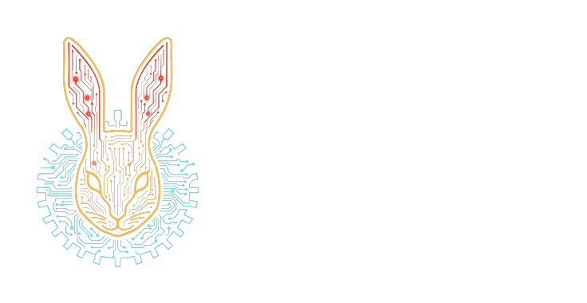

# kotlin-envformat



<p align=center>
    
    
</p>

`kotlin-envformat` is a Kotlin Multiplatform library for mapping structured `kotlinx.serialization` models to environment variables and decoding environment variables back into typed configuration objects.

It is designed for applications that want:

- explicit, versioned config models
- predictable `SCREAMING_SNAKE_CASE` environment variable names
- nested objects and lists without hand-written parsing
- a single serialization format that can be tested from plain maps

## What It Does

Given a serializable model like this:

```kotlin
import kotlinx.serialization.Serializable

@Serializable
data class DatabaseConfig(
    val host: String,
    val port: Int = 5432,
)

@Serializable
data class AppConfig(
    val debug: Boolean = false,
    val database: DatabaseConfig,
)
```

`kotlin-envformat` can decode this environment map:

```text
APP__DEBUG=true
APP__DATABASE__HOST=db.internal
APP__DATABASE__PORT=5433
```

into a typed `AppConfig`, and it can encode the same object back into a deterministic `Map<String, String>`.

## 🚀 Installation

```kotlin
commonMain.dependencies {
    implementation("one.wabbit:kotlin-envformat:0.0.1")
}
```

## 🚀 Usage

```kotlin
import kotlinx.serialization.Serializable
import one.wabbit.envformat.Env

@Serializable
data class DatabaseConfig(
    val host: String,
    val port: Int = 5432,
)

@Serializable
data class AppConfig(
    val debug: Boolean = false,
    val database: DatabaseConfig,
)

val env =
    mapOf(
        "APP__DEBUG" to "true",
        "APP__DATABASE__HOST" to "db.internal",
        "APP__DATABASE__PORT" to "5433",
    )

val config = Env.decode<AppConfig>("APP", env)

check(config.debug)
check(config.database.host == "db.internal")
check(config.database.port == 5433)
```

## Encode Example

```kotlin
import kotlinx.serialization.Serializable
import one.wabbit.envformat.Env

@Serializable
data class DatabaseConfig(
    val host: String,
    val port: Int = 5432,
)

@Serializable
data class AppConfig(
    val debug: Boolean = false,
    val database: DatabaseConfig,
)

val config =
    AppConfig(
        debug = true,
        database = DatabaseConfig(host = "db.internal", port = 5433),
    )

val encoded = Env.encodeToMap(config, prefix = "APP")

check(encoded["APP__DEBUG"] == "true")
check(encoded["APP__DATABASE__HOST"] == "db.internal")
check(encoded["APP__DATABASE__PORT"] == "5433")
```

## Lists

Lists are represented with indexed keys, plus an optional count:

```text
APP__ALLOWED_PORTS__COUNT=2
APP__ALLOWED_PORTS__0=5432
APP__ALLOWED_PORTS__1=5433
```

The decoder does not require `COUNT`, but the encoder writes it by default.
`Env.Config.listCountSuffix` defaults to `_COUNT`; the leading underscore is stripped before the
segment is joined with `__`, producing keys like `APP__ALLOWED_PORTS__COUNT`.

## Naming Rules

By default:

- property names become `SCREAMING_SNAKE_CASE`
- nested fields are joined with `__`
- prefixes are prepended before the field path

So `database.host` under prefix `APP` becomes `APP__DATABASE__HOST`.

Encoding omits default-valued properties unless `encodeDefaults = true` is passed or configured.
Boolean decoding accepts `true`/`false`, `1`/`0`, `yes`/`no`, `y`/`n`, and `on`/`off`.

## Platform Behavior

- JVM and Android use `System.getenv()` when you call `Env.decode<T>()` without passing a map.
- Native currently returns an empty environment by default, so common code should usually pass `env = ...` explicitly if it needs deterministic behavior across targets.

## Why Use The Map API In Tests

The map-based API makes configuration logic easy to test without mutating the real process environment:

```kotlin
val config = Env.decode<AppConfig>("APP", env = mapOf("APP__DATABASE__HOST" to "db.internal"))
```

That is usually the safest entry point for shared business logic.

## Status

This is an early `0.x` serialization format. The map encoding is useful today, but environment key
compatibility should be treated as part of your application's configuration contract and covered by
tests.

## Documentation

- [User guide](docs/user-guide.md)
- [API reference notes](docs/api-reference.md)
- [Troubleshooting](docs/troubleshooting.md)
- [Development](docs/development.md)

Generated API docs can be built locally with Dokka. See [API reference notes](docs/api-reference.md)
for the command.

## Release Notes

- [CHANGELOG.md](CHANGELOG.md)

## Support

Use the GitHub issue tracker for bugs and feature requests, or contact Wabbit Consulting Corporation
at `wabbit@wabbit.one`.

## Licensing

This project is licensed under the GNU Affero General Public License v3.0 (AGPL-3.0) for open
source use.

For commercial use, contact Wabbit Consulting Corporation at `wabbit@wabbit.one`.

## Contributing

Contributions are governed by the repository contribution policy and the Wabbit CLA. See
`CONTRIBUTING.md` and the files under `legal/`.
